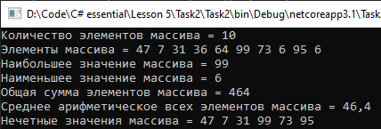

# Lesson5_task2
Условия задачки:
>Используя Visual Studio, создайте проект по шаблону Console Application.  
Требуется:  
Создать массив размерностью N элементов, заполнить его произвольными целыми значениями.  
Вывести наибольшее значение массива, наименьшее значение массива, общую сумму элементов, среднее арифметическое всех элементов, вывести все нечетные значения. 

Подытог: вот такенный майндфак на выходе
>
